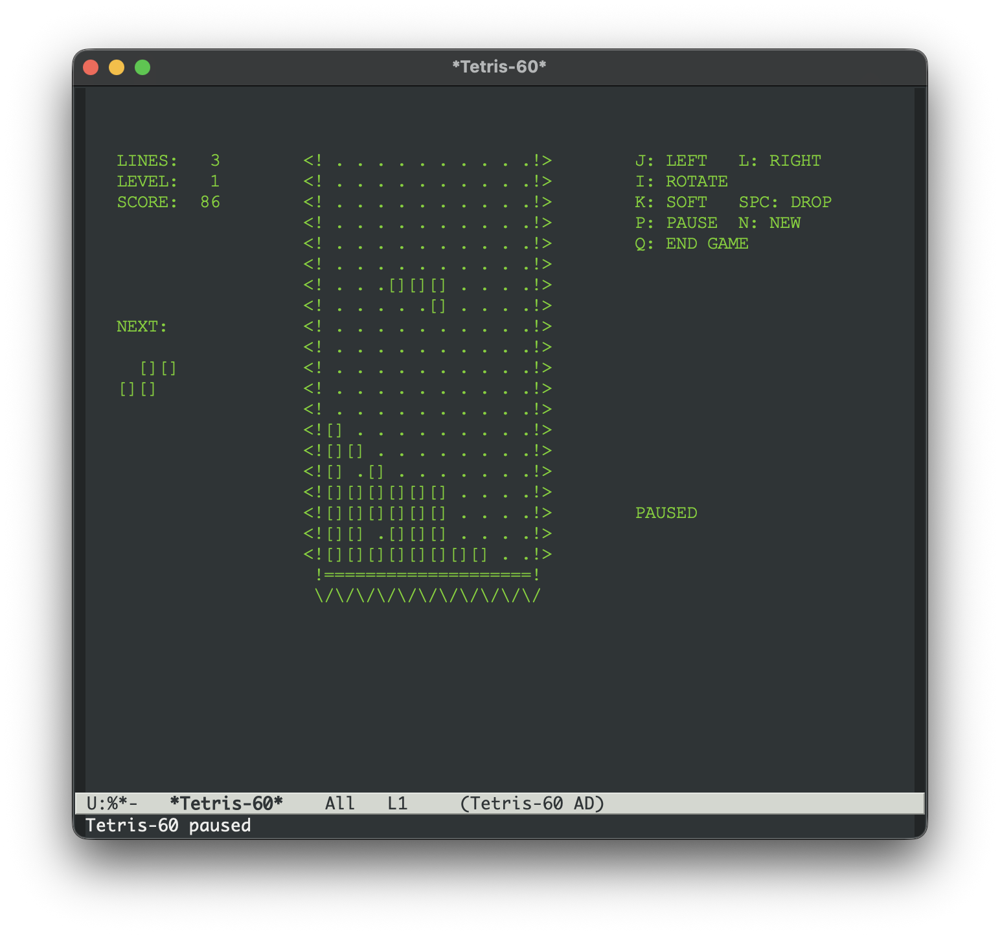
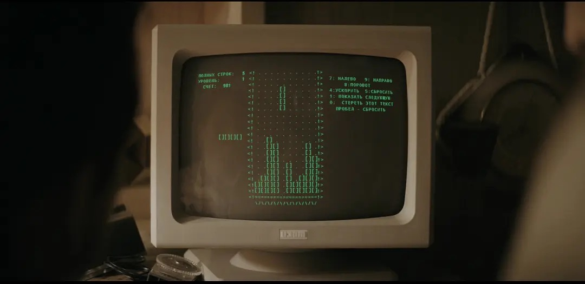

# tetris-60.el

Retro ASCII Tribute to the 1984 Original Tetris.

`tetris-60` is a faithful recreation of the original 1984 Tetris for Emacs, paying tribute to the masterpiece developed by Alexey Pajitnov on the Soviet Electronika 60 computer. It captures the authentic aesthetic of the early computing era—monochrome screens, dotted playfields, and iconic ASCII blocks—as celebrated in the *Tetris* (2023) movie.



*Inspired by the cinematic portrayal of the original game:*



## Behind the Name

- **Tetris**: A portmanteau coined by creator Alexey Pajitnov. He combined the Greek prefix **"Tetra"** (meaning "four," as every piece consists of four units) with **"Tennis"**, his favorite sport.
- **60**: A direct reference to the **Electronika 60** (Электроника 60), the rack-mounted terminal computer at the Soviet Academy of Sciences where the game was born in 1984. This machine had no graphics card or display; it could only output pure text characters. The iconic "green screen" scenes in the *Tetris* movie, where Pajitnov stares at the terminal to solve the logic of clearing lines, depict this exact machine.

## Features

- **Retro Aesthetic**: Pure ASCII rendering with a "phosphor green" theme to mimic 1980s computer screens.
- **Original Visuals**: Replicates the iconic `[ ]` block style and dotted playfield seen in the early Soviet versions.
- **Authentic Gameplay**: Standard 10x20 grid with the original tetromino set and scoring logic.
- **Score Persistence**: Automatically tracks your high scores in a local TSV file.
- **Customizable**: Tweak the colors, fonts, and grid styles to match your preferred retro look.

## Installation

Since `tetris-60` is a single-file package, you can install it by downloading `tetris-60.el` and loading it in your Emacs configuration:

```elisp
(add-to-list 'load-path "/path/to/tetris-60")
(require 'tetris-60)
```

Alternatively, you can use `M-x package-install-file` and select `tetris-60.el`.

## Usage

Start the game with:

`M-x tetris-60`

### Keybindings

| Key | Action |
|-----|--------|
| `j` / `Left` | Move Left |
| `l` / `Right` | Move Right |
| `i` / `Up` | Rotate |
| `k` / `Down` | Soft Drop |
| `SPC` | Hard Drop |
| `p` | Pause / Resume |
| `n` | New Game |
| `q` | Quit |

## Configuration

You can customize `tetris-60` via `M-x customize-group RET tetris-60`. Some notable options:

- `tetris-60-use-color`: Enable/disable the phosphor-green color scheme.
- `tetris-60-empty-cell-style`: Choose between `dot` (dotted grid) and `blank`.
- `tetris-60-font-family`: Set a specific font for the game buffer in GUI Emacs.
- `tetris-60-foreground-color` / `tetris-60-background-color`: Customize the retro colors.

## License

`tetris-60.el` is released under the GNU General Public License, version 3 or later. See the `LICENSE` file for details.
